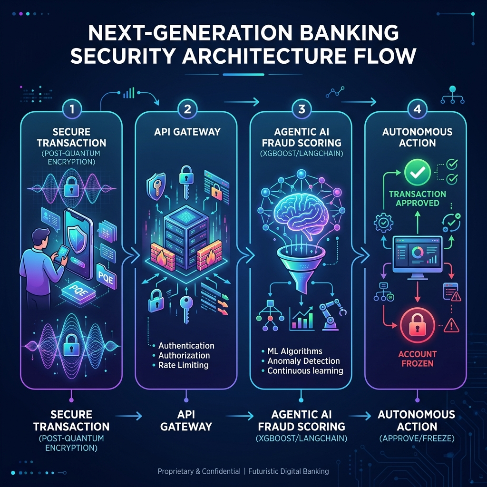

# Surakshify 🛡️
### Autonomous Fraud Defense for Confident Digital Banking

Surakshify is a cutting-edge, autonomous fraud defense platform built to secure next-generation digital banking. By combining **Agentic AI** for real-time anomaly detection with **Quantum-Safe Cryptography** (Post-Quantum lattice-based encryption), Surakshify safeguards financial transactions against sophisticated modern threats and future quantum computing vulnerabilities.

---

## 🚫 The Problem
Digital banking adoption is accelerating rapidly, but so is the complexity of financial cybercrime. 
1. **Traditional Rule-based Systems Fail**: Modern fraud patterns change too fast for traditional static fraud-detection rules, leading to missed attacks and high false-positive rates.
2. **The Quantum Threat**: Standard cryptographic protocols (RSA, ECC) securing banking transactions today will be completely broken by future quantum computers, exposing sensitive customer transaction histories.

## 💡 The Solution
Surakshify introduces a multi-layered, zero-trust autonomous fraud defense framework:
- **Quantum-Safe Security**: All transaction payloads are encrypted using lattice-based algorithms (Post-Quantum Cryptography) conceptually mimicking Kyber/liboqs standards.
- **Agentic AI Risk Evaluator**: A smart agentic pipeline evaluates the transaction metadata in real-time, learning and adapting to fraud patterns on the fly.
- **Autonomous Mitigation**: The system decides transaction outcomes in milliseconds—approving low-risk transactions, freezing high-risk actions instantly, and escalating suspicious activities for human evaluation.

---

## 🛠️ Tech Stack
- **AI/ML Engine**: Python, XGBoost, LangChain
- **Quantum Cryptography**: Qiskit, liboqs
- **Backend API**: FastAPI, Uvicorn
- **Development & Stubs**: Modular, extensible architecture

---

## 🏗️ Architecture Flow
The platform secures and processes transactions through a four-stage defense pipeline:



1. **Quantum Encrypted Payload**: Client initiates transaction -> data is encrypted using lattice-based post-quantum cryptography.
2. **Secure API Endpoint**: FastAPI ingests the encrypted payload and decrypts it in memory for scoring.
3. **Agentic AI Decisioning**: LangChain agents and XGBoost model evaluate transaction variables (amount, location, velocity, profile anomalies).
4. **Autonomous Action**: Instantly executes response rules:
   - `APPROVE` (Low risk)
   - `FREEZE` (High risk / Immediate lock)
   - `ESCALATE` (Moderate risk / Flag for Human-in-the-Loop review)

---

## 📂 Repository Structure
```
surakshify/
├── README.md                          # Project overview & documentation
├── LICENSE                            # MIT open-source license
├── .gitignore                         # Standard Python gitignore rules
├── requirements.txt                   # Dependency list
├── docs/
│   └── architecture-diagram.png       # visual flow of security & AI engine
├── src/
│   ├── ai_engine/
│   │   └── fraud_detector.py         # AI risk scoring & action stub
│   ├── quantum_security/
│   │   └── encryption_demo.py        # Post-quantum cryptography demo stub
│   └── api/
│       └── main.py                    # FastAPI application linking layers
└── demo/
    └── demo_video_link.md             # Link to video demo & walkthrough
```

---

## 🚀 Getting Started

### 1. Installation
Clone the repository and install the dependencies:
```bash
pip install -r requirements.txt
```

### 2. Run the API Server
Start the local FastAPI development server:
```bash
uvicorn src.api.main:app --reload
```
Once started, you can access:
- **API Documentation**: http://127.0.0.1:8000/docs
- **Health Check**: http://127.0.0.1:8000/

### 3. API Examples
**Evaluate a transaction:**
```bash
curl -X POST "http://127.0.0.1:8000/api/v1/evaluate" \
     -H "Content-Type: application/json" \
     -d '{
       "transaction_id": "tx_987654321",
       "user_id": "usr_nupur_2026",
       "amount": 12500.00,
       "merchant": "UnusualMerchant_Online",
       "location": "RemoteLocation",
       "timestamp": "2026-07-05T21:47:00Z"
     }'
```

---

## 👥 Team
- **A Shuveta Jovi**
- **Nupur Goswami**
- **Rijul Raisa Beura**

## 🏆 Hackathon Details
- **Event**: GFF 2026 — SBI Hackathon
- **Problem Statement**: Digital Adoption / Secure Banking Innovations